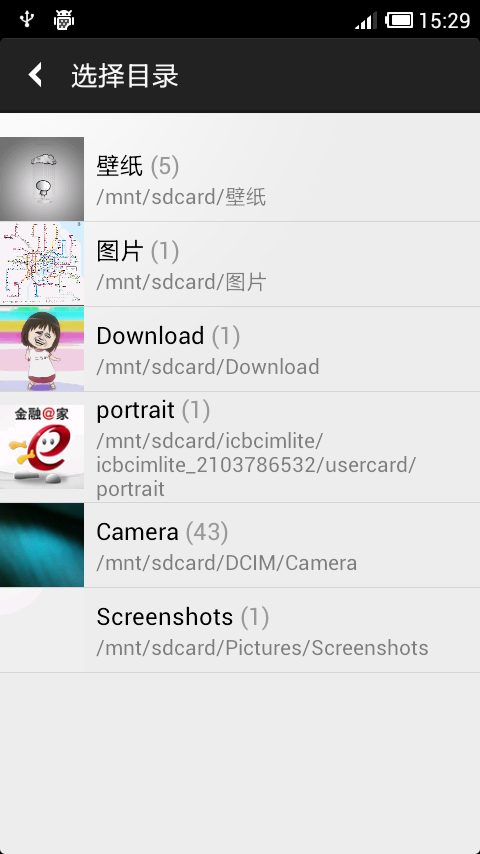
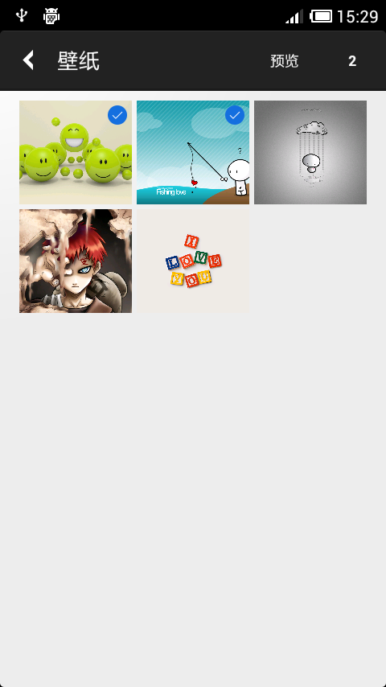

# 图片选择

可以一次性选择多张图片。通过Image URI实现。

在实际的项目中，经常会有从设备中选择图片显示或者上传的操作。在 Android 中从设备中选择一张比较容易，但是要一次性选择多张图片的功能，系统却没有提供的方法，只能自己来实现。

本 Demo 实现的功能：
1.从设别中选择0~N(可以设定)张图片。
2.支持选择的图片的预览，预览的同时可以取消选择。

Demo 中使用到了两个常用的库：
- [Android-Universal-Image-Loader](https://github.com/nostra13/Android-Universal-Image-Loader)
- [PhotoView](https://github.com/chrisbanes/PhotoView)

效果如下：

